# Unscented Kalman Filter (UKF)

Unscented Kalman Filter in C++ for Lidar and Radar data Sensor Fusion. This implementation of UKF is written in C++, custom and targeted to vehicle localization. It takes data from Lidar and Radar to calculate vehicle position and vehicle velocity.

There is bike data provided in this repo which I used to run my UKF on and to track a bike.

Remember that all Kalman filters have the same three steps:

1. Initialization
2. Prediction
3. Update

A standard Kalman filter can only handle linear equations. Both the extended Kalman filter and the unscented Kalman filter allow you to use non-linear equations; the difference between EKF and UKF is how they handle non-linear equations. But the basics are the same: initialize, predict, update.

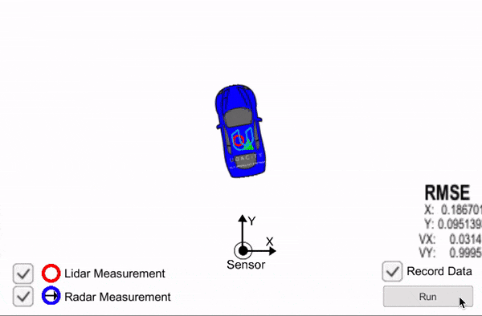

## Test Results

I ran this algorithm on 3 datasets provided in _data_ folder of this repo and generated 3 corresponding output files present in _output_ folder of this repo.


### Test Results For Data _obj_pose-laser-radar-synthetic-input.txt_

Accuracy - RMSE:
```
0.0602885
0.0851989
0.276432
0.183529
```
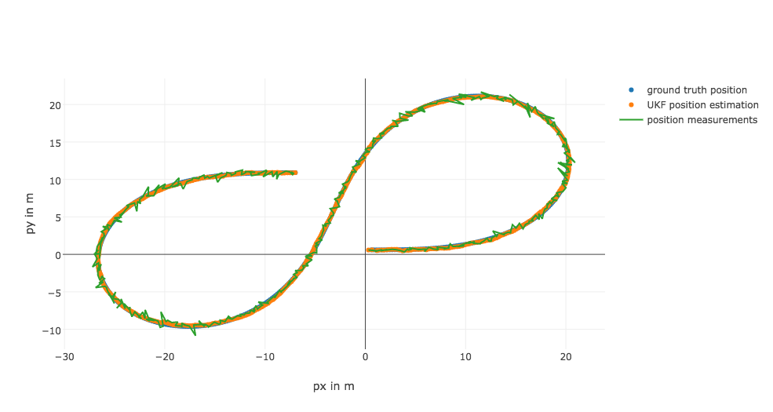

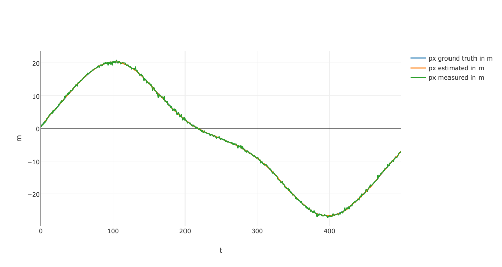

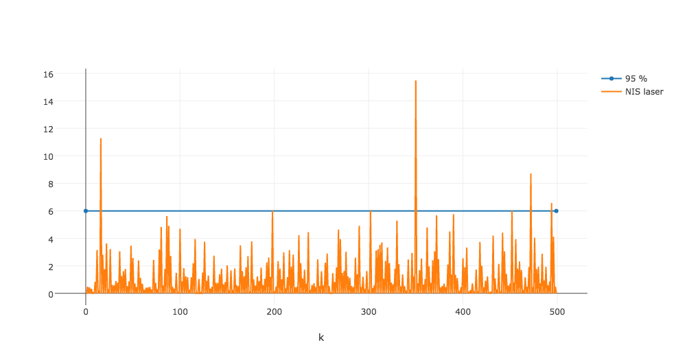

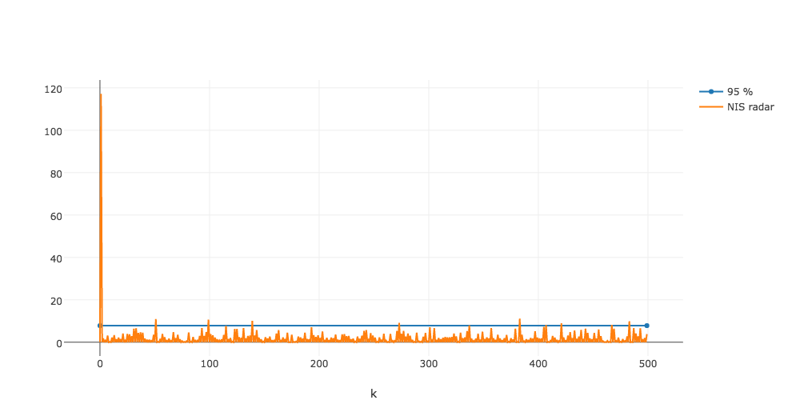

### Test Results For Data _sample-laser-radar-measurement-data-1.txt_

Accuracy - RMSE:
```
0.0693711
0.077352
0.581971
0.569303
```

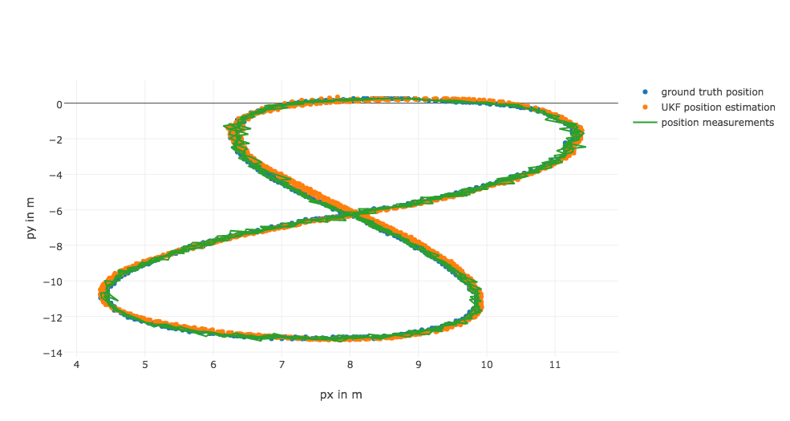

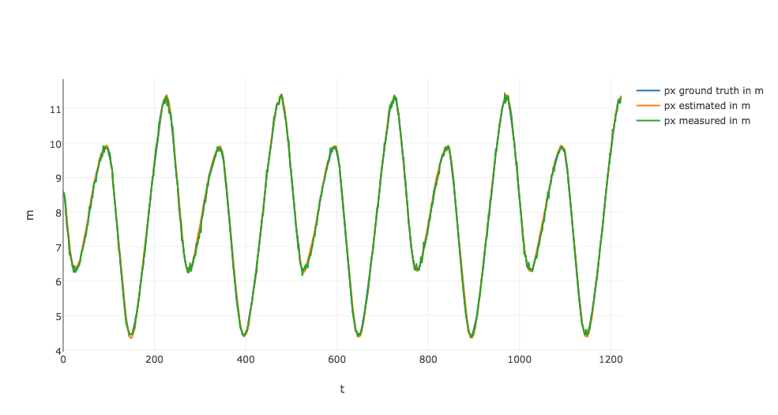

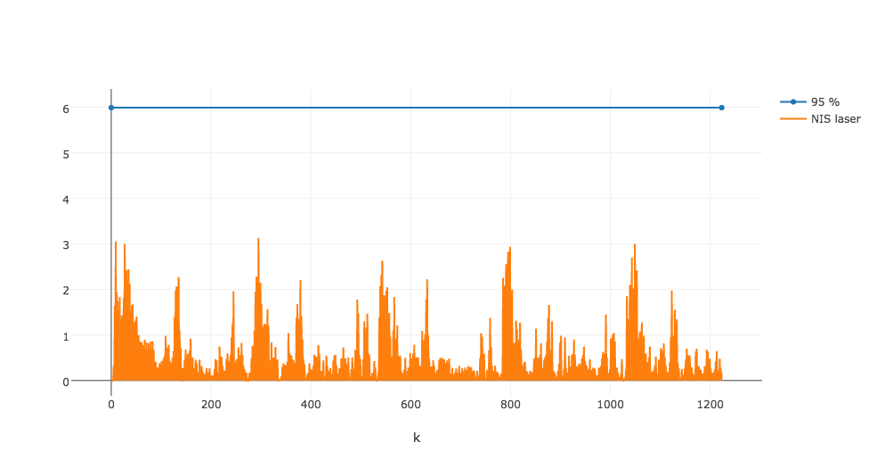

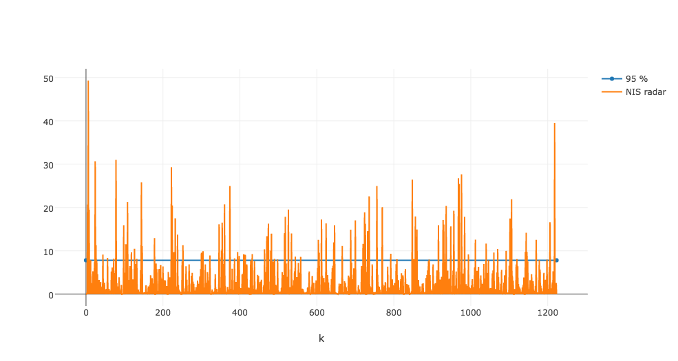

### Test Results For Data _sample-laser-radar-measurement-data-2.txt_

```
Accuracy - RMSE:
0.189321
0.188939
0.347146
0.503328
```

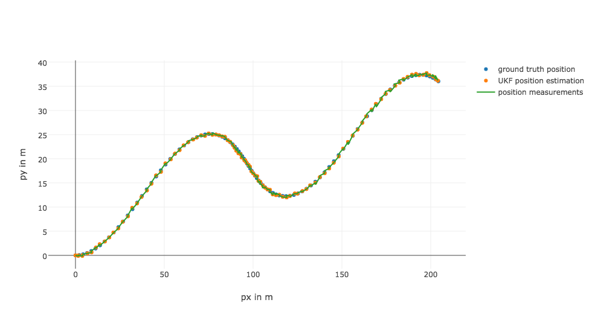

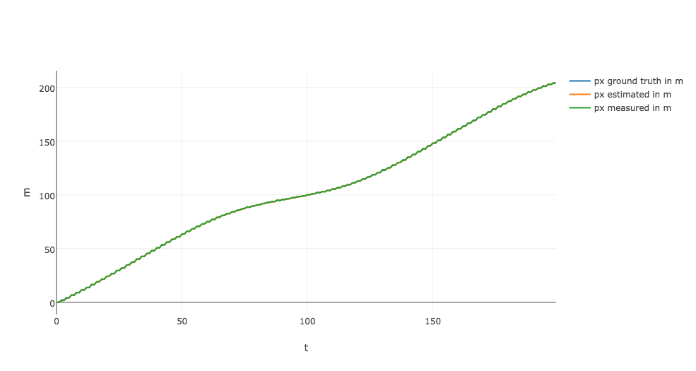

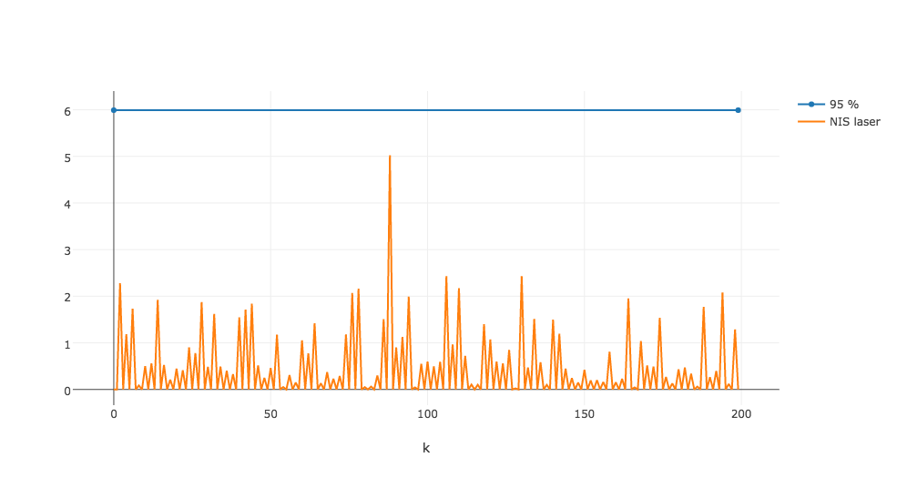

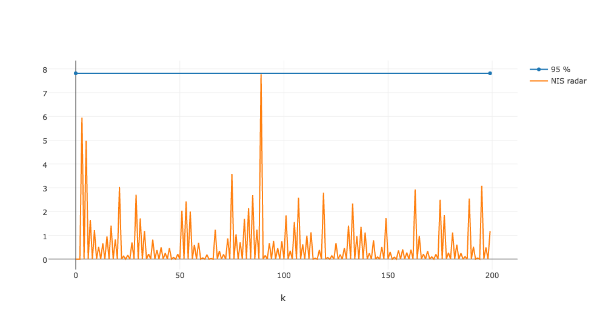

## Getting Started

```
// Create a UKF instance
UKF ukf;

// Create a measurement package to process
MeasurementPackage measurement_pack;

measurement_pack.sensor_type_ = MeasurementPackage::LASER;
measurement_pack.raw_measurements_ = VectorXd(2);

float px = 1;
float py = 2;
long timestamp = 45454354; //some timestamp in micro seconds

measurement_pack.raw_measurements_ << px, py;
measurement_pack.timestamp_ = timestamp;

fusionEKF.ProcessMeasurement(measurement_pack);
Eigen::VectorXd x = ukf.GetMeanState(); 
std::cout << "Estimated x: " << x << std::endl;
```

## Class Details

- **UKF** contains all core code/calculations required for Unscented Kalman Filter like initialization, prediction and update steps of UKF.

- **Tools** contains utility functions to calculate RMSE to evaluate EKF accuracy and to calculate NIS value to check Filter consistency.

## Learn the Math Behind UKF

You can find many lectures on UKF on the web. You can view my [notes](https://drive.google.com/open?id=0Bxv9kPZMr-zbU3BhNkhXTXhYbDg) for UKF. You can also view some brief [notes](https://drive.google.com/open?id=0BzhenLaF0FKGSHhhVkNLUEVYcDQ) written by a Udacity student (I forgot the name).


## Basic Build Instructions

1. Clone this repo. You can use the _**build-script.sh**_ to build and run with cmake and make automatically or you can follow steps given below.
2. Make a build directory: `mkdir build && cd build`
3. Compile: `cmake .. && make` 
   * On windows, you may need to run: `cmake .. -G "Unix Makefiles" && make`
4. Run it: `./UnscentedKF path/to/input.txt path/to/output.txt`. You can find
   some sample inputs in 'data/'.
    - eg. `./UnscentedKF ../data/sample-laser-radar-measurement-data-1.txt output.txt`

## Dependencies

* This code uses [Eigen library](http://eigen.tuxfamily.org/index.php?title=Main_Page). I have also added this library to repo for convinience. You can also download it directly to get its latest version.

* cmake >= 3.5
 * All OSes: [click here for installation instructions](https://cmake.org/install/)
* make >= 4.1
  * Linux: make is installed by default on most Linux distros
  * Mac: [install Xcode command line tools to get make](https://developer.apple.com/xcode/features/)
  * Windows: [Click here for installation instructions](http://gnuwin32.sourceforge.net/packages/make.htm)
* gcc/g++ >= 5.4
  * Linux: gcc / g++ is installed by default on most Linux distros
  * Mac: same deal as make - [install Xcode command line tools]((https://developer.apple.com/xcode/features/)
  * Windows: recommend using [MinGW](http://www.mingw.org/)
  
## Possible Issues and Improvements

- For some datasets (e.g., sample-laser-radar-measurement-data-2.txt) my NIS consistency check did not give me good results. It looks like I am overestimating uncertainty for Lidar data and underestimating for Radar data. It can be definitely improved.
- If there is a division by zero I ignore that measurement update completely. May be there is a better way to handle it.
